## How does the receiver know where one message ends and the next begins?

- A wire is just a continuous stream of bits — there are no natural gaps between messages.
- Framing is the act of wrapping data in markers so the receiver can find the start and end of each packet/frame.

*Fragment structure*

When nothing is being transmitted, the line isn't just left floating or silent — it continuously sends all 1s (111111...). This serves a few purposes:

**Why all 1s for idle?**
* It keeps the physical line in a known, stable "mark" state (HIGH voltage)
* It lets the receiver distinguish "no frame right now" from "loss of signal" (which would look like all 0s or noise)
* The receiver counts the ones — if it sees 7 or more consecutive 1s, it knows the line is idle (not a flag, not stuffed data)

## Common terms

### Preamble
Preamble is the "wake-up" sequence sent before a frame — a known pattern of bits that lets the receiver synchronize its clock and know that real data is about to arrive.

**Why it needed?**

The transmitter has its own crystal oscillator running at, say, 1 MHz. The receiver has its own separate crystal also rated at 1 MHz. But no two crystals are perfectly identical — one might actually run at 1,000,001 Hz and the other at 999,998 Hz. After receiving thousands of bits, the receiver's sampling point has drifted and it starts misreading bits.

This is called clock drift, and it's why the receiver needs to constantly re-sync its clock to the transmitter's rhythm.

**How many preamble bits are sent?**

It depends on the protocol:

| Protocol | Preamble length | Why |
|---|---|---|
| Ethernet (10BASE-T) | 56 bits (`10101010` × 7 bytes) | Enough for PLL to lock |
| Ethernet (then SFD) | + 1 byte `10101011` | Marks "preamble over, frame starts now" |
| HDLC on slow links | ~8–16 bits | Shorter — clock drift less severe |
| Bluetooth | 8 bits | Radio link, fast lock needed |

**The hardware doing the locking: PLL**

The receiver circuit that does this is called a **Phase-Locked Loop (PLL)**. It works like this:

1. It detects each rising/falling edge in the preamble
2. It measures the time between edges — that's the bit period
3. It adjusts its own oscillator until it fires exactly halfway between edges (the safest sampling point — furthest from both transitions)
4. Once it's consistently hitting the middle, it's "locked"

After lock, even if the transmitter sends long runs of the same bit (no transitions), the PLL holds its timing from memory for a short while — which is also why HDLC guarantees a transition at least every 6 bits (via bit stuffing), so the PLL never drifts too far before getting another edge to re-sync on.

So in short: `10101010...` is the most transition-rich pattern possible — a transition every single bit — which is exactly what a PLL needs to lock as fast as possible.

### SFD
Start Frame Delimiter, It's the single byte that says "preamble is over, real data starts NOW."

The byte is always: `10101011`
Notice it's almost identical to the preamble pattern 10101010 — except the last bit flips from 0 to 1. That's the signal to the receiver: "you just saw something different — this is your marker."

**Why does the SFD end in 11 specifically?**
The preamble is strictly alternating — every bit flips. So 10 repeating forever. The moment the receiver sees two 1s in a row (...101011), it knows the alternating pattern has broken — that's a unique signature that cannot appear anywhere inside the preamble. It's unambiguous.

The preamble is strictly alternating — every bit flips. So `10` repeating forever. The moment the receiver sees two `1`s in a row (`...101011`), it knows the alternating pattern has broken — that's a unique signature that cannot appear anywhere inside the preamble. It's unambiguous.

**What the receiver does at each stage:**

| Stage | Receiver action |
|---|---|
| Seeing preamble `10101010...` | PLL locking — adjusting clock, ignoring bit values |
| Sees `10101011` (SFD) | Clock is locked, arms its frame capture logic |
| Next bit after SFD | Starts storing bits as the destination MAC address |

**One important thing** — in Ethernet, note that the SFD plays the same role as the HDLC flag (`01111110`), but differently. HDLC uses bit stuffing to make its flag unique. Ethernet instead uses the preamble pattern itself — the `11` ending is unique because the preamble guarantees only `10` pairs ever appear before it. Simpler, but only works because the preamble comes first.

## Protocol
Ethernet and HDLC are two different protocols at Data link layer. They do NOT use each other's mechanisms.

### Ethernet
preamble `10101010` $\cdots \rightarrow$ SFD `10101011` $\rightarrow$ ethernet frame $\rightarrow$ (nothing — no stop flag)

Ethernet has no closing flag at all. The receiver knows the frame ended by the CRC passing and the line going idle.

Ethernet is the standard protocol used for wired Local Area Networks (LANs). It is used in environments where many devices (computers, printers, servers) share the same network media. When data travels over an Ethernet cable, it is organized into a specific format called an Ethernet Frame. This structure ensures that devices can recognize the start of a message, identify the sender and receiver, and verify that the data arrived without errors.

* Topology: Usually a star or bus topology.
* Media Access: Multi-access. Multiple devices are connected to the same network and must compete for time to speak.
* Addressing: Uses MAC Addresses (48-bit physical addresses) to distinguish between hundreds of potential devices on the same segment.

**The Why**: In an office or home, need a way for many devices to talk to each other over the same wires. Ethernet provides the "rules of the road" so that data reaches the correct device among many.

#### 1. Preamble (7 Bytes)
The Preamble consists of seven bytes of alternating 1s and 0s ($10101010$). Its purpose is clock synchronization.

**The Why**: Electronic components need to "pulse" at the exact same speed to interpret bits correctly. The Preamble allows the receiving network interface card (NIC) to lock onto the rhythm of the incoming electrical signal before the actual data arrives.

#### 2. Start Frame Delimiter - SFD (1 Byte)
The SFD is the byte $10101011$. It follows the Preamble.

**The Why**: While the Preamble synchronizes the timing, the SFD signals the official start of the frame. The last two bits being $11$ break the pattern and tell the receiver, "The very next bit is the start of the Destination MAC Address."

#### 3. Destination MAC Address (6 Bytes)
Every network card in the world has a unique 48-bit MAC address burned in at the factory. The first 3 bytes identify the manufacturer (OUI — you can look up who made a card from it). The last 3 bytes are unique to that specific card. FF:FF:FF:FF:FF:FF is the broadcast address — every device on the LAN receives it.

**The Why**: Ethernet is a multi-access medium, meaning multiple devices might "hear" the signal. The hardware uses this field to determine if the frame should be processed or ignored. If the address matches the device's MAC (or is a broadcast address), the NIC accepts it.

#### 4. Source MAC Address (6 Bytes)
This field contains the physical address of the device that generated the frame.

**The Why**: This allows the receiving device to know where the data originated. It is essential for bidirectional communication, as the receiver needs this address to send a reply back.

#### 5. EtherType / Length (2 Bytes)
This field serves two purposes depending on the version of Ethernet used. In modern networks, it almost always functions as the EtherType. It contains a code that identifies which protocol is encapsulated inside the frame (e.g., IPv4, IPv6, or ARP).

**The Why**: A computer runs many different networking processes at once. Once the hardware accepts a frame, it must know which software "department" to send the data to. Without the EtherType, the operating system would not know if it is looking at an internet packet (IP) or a different type of network traffic.

#### 6. Data and Pad (46 to 1500 Bytes)
This is the actual information being transmitted, such as a piece of a website, an email, or a file.
* Maximum Transmission Unit (MTU): The standard limit is 1500 bytes.
* Minimum Size: A frame must be at least 64 bytes long (from Destination MAC to the end). If the data is too small, "padding" (extra zeros) is added to reach the minimum size.

**The Why:**
* The Upper Limit (1500): This prevents a single device from hogging the wire for too long, allowing other devices a chance to transmit.
* The Lower Limit (64): This is critical for collision detection. The frame must be long enough to stay "on the wire" for a specific duration so that if a collision occurs, the sending device is still transmitting and can actually detect the interference.

#### 7. Frame Check Sequence - FCS (4 Bytes)
The FCS is a mathematical value located at the very end of the frame. It is created using an algorithm called a Cyclic Redundancy Check (CRC). The sender calculates a number based on the bits in the frame and attaches it here.

**The Why**: Electrical interference or hardware glitches can flip a bit from a $0$ to a $1$ during transit. When the frame arrives, the receiver performs the same calculation. If the receiver's result does not match the FCS attached to the frame, the data is corrupted. The receiver then silently drops (deletes) the frame. Ethernet does not fix errors; it only detects them to prevent corrupted data from reaching the computer's CPU.

#### Interpacket Gap (IPG)
While not technically part of the frame itself, there is a mandatory silence period between frames equivalent to 12 bytes of transmission time.

**The Why**: This "dead air" provides the receiving hardware time to finish processing the current frame and prepare the buffers for the next incoming signal. It prevents frames from overlapping and becoming unreadable.

### HDLC
HDLC (High-level Data Link Control) is a classic framing protocol. It is a bit-oriented protocol used to transmit data between network nodes. Unlike Ethernet, which is designed for multi-access Local Area Networks, HDLC is primarily used for point-to-point or point-to-multipoint communication over Wide Area Networks (WANs). It is typically used for long-distance links connecting two routers. It wraps every frame with a special flag byte 01111110 (6 ones between two zeros) at both ends. The receiver watches for this pattern to find frame boundaries.

* Topology: Point-to-Point or Point-to-Multipoint.
* Media Access: Dedicated. The link is usually a private "pipe" between specific locations (like a branch office and a headquarters).
* Addressing: Simple or unnecessary. Since there are often only two devices on the link, complex addressing like MAC addresses is not required.

**Bit stuffing** is the clever trick that makes HDLC work. If our actual data accidentally contains 01111110, the receiver would think it's a frame boundary and cut the frame short. So the transmitter stuffs (inserts) a `0` after every five consecutive `1s` in the data — the receiver automatically removes them. This guarantees the flag pattern can never appear inside data.

**The Why**: When connecting two routers across hundreds of miles, we do not need the complexity of Ethernet’s multi-device management. we need a lightweight, reliable way to ensure bits travel from one end of the long-distance serial cable to the other without errors.

#### 1. Flag Field (1 Byte)
The Flag field is the sequence `01111110`. It appears at both the very beginning and the very end of every HDLC frame.

**The Why**: This specific pattern acts as a boundary marker. Since data travels in a continuous stream of electrical signals, the receiver needs a way to identify where one frame ends and the next begins. By looking for the unique 01111110 pattern, the hardware stays synchronized with the frame boundaries.

**Note on Bit Stuffing**: To prevent the receiver from confusing actual data with a Flag, the sender inserts a extra 0 after every five consecutive 1s in the data. This ensures the Flag sequence only appears at the boundaries.

#### 2. Address Field (1 Byte or more)
In point-to-point links, this field is often a simple broadcast address (11111111). In multipoint links, it identifies the specific secondary station.

**The Why**: Even on a direct link between two points, the protocol requires a destination identifier to maintain its structural rules. This ensures the receiving hardware knows the frame is intended for it.

#### 3. Control Field (1 or 2 Bytes)
This field defines the type of frame being sent. There are three primary types:
* Information (I-frames): Carries user data.
* Supervisory (S-frames): Used for flow control and error requests (e.g., "Ready to Receive" or "Reject").
* Unnumbered (U-frames): Used for link management, such as setting up or disconnecting the connection.

**The Why**: HDLC is a connection-oriented protocol. The Control Field allows the two devices to talk to each other about the status of the link. It manages which frames have been received and which need to be resent, ensuring a reliable delivery of data.

#### 4. Information Field (Variable Length)
This field contains the actual payload or data from the higher layers of the network stack.

**The Why**: This is the "cargo" of the frame. Unlike Ethernet, HDLC does not have a strict minimum size requirement for the data field, though the maximum size is determined by the specific hardware configuration.

#### 5. Frame Check Sequence - FCS (2 or 4 Bytes)
The FCS is a 16-bit or 32-bit value calculated using a Cyclic Redundancy Check (CRC).

**The Why**: Long-distance WAN links are susceptible to noise and signal degradation. The FCS allows the receiver to perform a mathematical check on the arriving bits. If the calculation does not match the FCS value sent, the frame is discarded to prevent corrupted information from being processed.

### Difference in "The Why": Ethernet vs. HDLC
While both use a Frame Check Sequence for error detection, they differ in how they identify the start of a message. Ethernet uses a Preamble for clock synchronization because it is a shared-access medium. HDLC uses a Flag and Bit Stuffing because it is a continuous bit-stream protocol designed for dedicated links.