## The Foundation: The "Clock"
Every network card has an internal oscillator (a clock) that ticks at a specific frequency (e.g., 10 million times per second for 10 Mbps Ethernet).
* The Sender: Uses its clock to decide when to put a bit on the wire.
* The Receiver: Uses its own clock to decide when to "look" at the wire to read that bit.
The problem is that these two physical clocks are never perfectly identical. They are manufactured by different companies and operate in different temperatures, leading to two specific failures: Clock Phase issues and Clock Slip.

## Clock Phase (The "Where" Problem)
Clock Phase refers to the alignment of the "ticks" between the sender and the receiver.

- Digital signals don't change from 0 to 1 instantly; they follow a curve.
- Setup & Hold Times: To read a "1" reliably, the voltage must be stable for a tiny window of time.
- The Result: If the receiver samples during that vertical climb (the transition), the voltage might be at 0.5V. The receiver’s hardware won't know if that's a high 0 or a low 1, leading to metastability or bit errors.

Even if both clocks are ticking at the exact same speed, they might start at different times. If the receiver "looks" at the wire exactly when the sender is in the middle of changing a bit, the receiver gets a blurry or transitional signal instead of a clean 0 or 1.

The Goal: The receiver needs to align its "look" (its phase) to the middle of the sender’s bit, where the signal is most stable.

## Clock Slip (The "Speed" Problem)
Clock Slip occurs when one clock is slightly faster or slower than the other. This is cumulative, meaning the error grows over time.

Imagine the sender transmits a long string of 0s.
* The sender's clock is exactly 10.0 MHz.
* The receiver's clock is 10.1 MHz (slightly faster).
* After 100 bits, the receiver’s faster clock will have "ticked" 101 times.

The receiver will think it saw 101 bits of data when the sender only sent 100. This "extra" or "missing" bit is a Clock Slip. It corrupts the entire data stream because every bit after the slip is now in the wrong position.

## Manchester Encoding is the Solution

###  Root Problem (Why This Topic Exists)
#### Why
- When a sender transmits data, the receiver must know when to read each bit. The receiver uses its own internal clock to decide the timing.
- The receiver clock and sender clock are two separate hardware oscillators. They never run at exactly the same speed forever — they drift apart over time.

#### Problem 
- When the receiver clock drifts, the rising edge (latch trigger) no longer falls at the center of the bit. It starts falling closer and closer to the transition zone — the dangerous boundary between two bits.
- Once the rising edge lands on a transition, the latched value is wrong or random.
- The receiver has no way to know it has drifted. There is no feedback. It just silently reads wrong bits.

#### Need
The receiver needs a way to re-synchronize its clock continuously — not just once at the start, but on every single bit — so drift never accumulates to a dangerous level.

### What Synchronization Actually Requires
#### What
- To re-synchronize, the receiver needs a reference point — a moment in time where the signal does something predictable. The receiver can use that moment to reset or nudge its clock back to the correct phase.
- A transition on the wire (the voltage changing from high $\rightarrow$ low or low $\rightarrow$ high) is a detectable event. It has a precise moment in time.
#### Problem
In standard binary encoding (NRZ — Non-Return-to-Zero), a 1 is high voltage and a 0 is low voltage for the entire bit period. If the data has several consecutive identical bits — e.g. `1 1 1 1 1` — the wire stays flat with no transitions at all. No transitions = no reference points = no way to re-synchronize.
#### Conclusion
Any encoding that can produce long runs of the same voltage level is fundamentally unreliable for clock recovery over time.

### Manchester Encoding: The Idea
#### What
Manchester Encoding is a method of encoding binary data onto a wire such that every single bit period is guaranteed to contain exactly one transition (high $\rightarrow$ low or low $\rightarrow$ high) — regardless of what the bit value is.

#### Key Rule

The two primary types of Manchester encoding are *Standard Manchester Encoding* and *Differential Manchester Encoding*

**Standard Manchester Encoding/IEEE 802.3 Ethernet/ G.E.Thomas Method**
- Low  $\rightarrow$ High  means 1
- High  $\rightarrow$ Low  means 0

**Differential Manchester Encoding/IEEE 802.5 Token Ring**
- Low  $\rightarrow$ High  means 0
- High  $\rightarrow$ Low  means 1

For discussion let's take *IEEE 802.3 Ethernet*

Each bit period is split into two equal halves. The transition that happens at the midpoint of the bit period encodes the bit value:
- Bit 0 = transition from HIGH  $\rightarrow$ high LOW at the midpoint
- Bit 1 = transition from LOW $\rightarrow$ HIGH at the midpoint

Because Manchester encoding requires a transition in the middle of every bit, the signal must change states twice as fast as the actual data rate.



- Manchester uses 2 $\times$ the frequency (bandwidth). To send `N` bits per second, `NRZ` needs `N Hz` of bandwidth. Manchester needs `2*N Hz` — because every bit has at least one mid-period transition, and consecutive identical bits also add a boundary transition (like the 1 $\rightarrow$ 1 boundary at position 3 $\rightarrow$ 4 in the diagram, marked in orange). That boundary transition carries no data — it just repositions the line for the next bit's mid-transition.

- Manchester encoding uses one full clock cycle to transmit a single bit, but because that bit must contain a transition in the middle, the "signal" is changing twice as fast as the "data."
- It is one clock cycle per bit, but it effectively uses both the rising edge and the falling edge of an internal faster clock.

| | NRZ | Manchester |
|---|---|---|
| Bandwidth needed | 1x | 2x |
| Self-clocking | No | Yes |
| Sync loss risk | High (long runs) | None |
| Used in | Serial, USB | Ethernet (10BASE-T), IR remotes |

### Why This Solves Clock Recovery

#### HOW IT SOLVES IT
- Because every bit period has a guaranteed midpoint transition, the receiver always has a fresh reference point every single bit. The receiver detects the transition and uses it to reset its clock phase precisely.
- Even if the receiver clock drifted slightly during the previous bit, the next midpoint transition corrects it immediately. Drift never accumulates across multiple bits.

#### KEY INSIGHT
The clock information is embedded inside the data signal itself. There is no separate clock wire needed. The receiver extracts timing and data from the same signal simultaneously.

### The Trade-off
#### TRADE-OFF
Manchester Encoding uses twice the bandwidth of NRZ. To send 1 bit of data, the signal must make 2 half-period transitions. The wire must switch at twice the rate. This means the physical medium (wire, fiber, radio) must handle twice the signal frequency to carry the same amount of data.
#### WHERE IT IS USED
Manchester Encoding is used in systems where reliable clock recovery is more important than bandwidth efficiency:
- Ethernet (10BASE-T, classic Ethernet)
- RFID communication
- Industrial sensors and serial protocols

#### The question: does Manchester use 2 clock cycles per bit, or does it use both edges of 1 cycle?
It uses both edges of 1 clock cycle. One bit still takes exactly one clock period. But within that one period, the signal must switch at least once (at the midpoint) and sometimes twice (midpoint + boundary). The wire switches at 2× the rate — not because two full clock cycles are used, but because the signal uses the rising edge AND the falling edge of a single clock cycle as switching points. That is what "2× frequency" means — the wire toggles twice per clock cycle instead of once.

* Rising edge - Signal Flip
* Clock High  - Holds the new value
* Fall edge   - If next bit is same as setted bit, then it will switch transit to opposit of current state, else No transit change
* Clock Low   - Maintain the stage setted up in Fall edge

[Explaination](./res/manchester_1011001_step_by_step.html)

## Protocols used in physical layer
* Ethernet sjgnalling (NRZ, 4B5B, PAM4)
* Manchester encoding (10BASE-T)
* Optical fibre
* RS-232
* RS-485

## Topology
A network is a collection of devices connected so they can exchange data. The word topology describes the physical arrangement of those devices and the wires between them — specifically, which devices connect to which, and how many wires exist.

Topology is chosen based on three factors: cost of cabling, fault tolerance (what happens when one wire breaks), and whether devices need to share a wire or have dedicated wires.

**Concept: shared medium vs dedicated link**
This is the single most important idea behind all topologies. It must be understood first.

* A dedicated link means one wire connects exactly two devices. No other device uses that wire. The full speed of the wire belongs to those two devices at all times.

* A shared medium means one wire connects more than two devices. All those devices use the same wire. When device A sends data, device B, C, and D all see it on the wire too. Only one device can transmit at a time — if two transmit simultaneously, the signals collide and both are destroyed. Rules must exist to prevent this (e.g. CSMA/CD in Ethernet).

All topologies are variations of these two ideas.


### 1. Point-to-Point Topology

**What it is**: One wire. Two devices. Nothing else connects to that wire.

**Structure**: `Device A ———— Device B`

**Key property**: The wire is dedicated. There is no sharing, no collision, no need for rules about who transmits when. The full bandwidth of the wire is always available.

**Where it is used**: WAN links between two routers (HDLC runs on these). A direct serial cable between two computers. Leased lines rented from a telecom provider connecting two offices.

**What happens when the wire breaks**: Both devices lose connectivity to each other. There is no alternative path.

### 2. Bus Topology

**What it is**: One long backbone wire runs through the network. Every device connects to this backbone via a short drop cable and a T-shaped connector. The backbone has a terminator cap at each end to absorb signals so they do not reflect back.

**Structure**:
```
A     B     C     D     E
|     |     |     |     |
|=====|=====|=====|=====|   <--- backbone wire
```

**Key property**: The backbone is a shared medium. When any device transmits, the signal travels the entire length of the backbone and every other device receives it. Only the device whose address matches accepts it; others ignore it. Only one device can transmit at a time.

**Where it is used**: Early Ethernet installations (10BASE-2, 10BASE-5) from the 1980s and 1990s. Rare today.

**What happens when the wire breaks**: The backbone splits into two isolated segments. The terminators are gone from the break point, causing signal reflections. The entire network stops working.

**Why it is not used today**: One cable failure kills the whole network. Fault isolation is impossible — the broken point can be anywhere along the backbone.

### 3. Star Topology

**What it is**: Every device has its own dedicated wire that connects only to a central device (a switch or hub). No device connects directly to another device.

**Structure**:

```
        A
        |
  D - Switch - B
        |
        C
```

**Key property**: Each wire is a dedicated point-to-point link between one device and the switch. No device shares a wire with any other device. There are no collisions on the wires (in a switch-based star).

**Where it is used**: Every modern Ethernet LAN. Home routers. Office networks. This is the standard today.

**What happens when a wire breaks**: Only the one device on that wire loses connectivity. All other devices are unaffected. This makes faults easy to find and fix.

**Why it replaced bus**: Fault isolation. A broken cable affects one device, not the entire network.

**Important distinction — switch vs hub in a star**:

* A switch gives each device a dedicated link and forwards frames only to the correct destination port. No device sees another device's traffic.

* A hub is electrically the same as a bus — it repeats every signal to every port. All devices still share the medium and need CSMA/CD. Hubs are obsolete.

### 4. Multipoint Topology

**What it is**: Multiple devices connect onto a single shared wire, but unlike bus topology, there are no drop cables or T-connectors — devices tap directly onto the wire at connection points.

**Structure**: `A — B — C — D — E` (all on the same wire, physically touching it)

**Key property**: Shared medium. All devices see all transmissions. Rules (CSMA/CD) are required. This is the general name for any topology where a single wire serves more than two devices.

**Difference from bus topology**:

| | Bus | Multipoint |
|---|---|---|
| How devices connect | Drop cables + T-connectors tap off a backbone | Devices connect directly at points along the wire |
| Terminators | Required at both ends | Not always required |
| Concept | A specific physical implementation | A general concept describing any shared wire |

Bus topology is one physical implementation of the multipoint concept. Multipoint is the broader category.

### 5. Point-to-Multipoint Topology
**What it is**: One central device (called the Hub, or Head End) has individual point-to-point links to multiple remote devices (called Spokes or Branches). Each Hub-to-Spoke connection is a dedicated link.

**Structure**:
```
        HQ
       /|\ \
      / | \ \
    B1 B2 B3 B4
```

**Key property**: Each spoke has its own dedicated wire to the hub. However, spoke devices cannot communicate with each other directly — all traffic must go through the hub. Hub-to-spoke is point-to-point. Spoke-to-spoke does not exist as a direct connection.

**Where it is used**: Internet service providers (ISPs) connecting customer premises. Cable TV networks (head end to homes). Satellite networks (ground station to many receivers). Corporate WAN where headquarters connects to branch offices.

**Difference from star topology**:

| | Star | Point-to-Multipoint |
|---|---|---|
| Central device role | Switch — forwards between any two devices | Hub/Head-end — controls all communication |
| Can devices talk to each other | Yes, via the switch | No, all traffic must pass through the hub |
| Scale | Local area (same building) | Wide area (different cities or countries) |
| Typical use | LAN | WAN, ISP, satellite |

In a star, device A can send directly to device B through the switch. In point-to-multipoint, branch B1 cannot send to branch B2 without the data going to HQ first, then HQ forwarding it to B2.

### 6. Mesh Topology

**What it is**: Every device has a direct dedicated link to every other device (full mesh), or to multiple but not all other devices (partial mesh).

**Full mesh structure (4 devices = 6 links)**:
```
A---B
|\ /|
| X |
|/ \|
D---C
```

**Number of links in a full mesh**: For N devices, `the number of links = N × (N−1) ÷ 2`. For 10 devices, that is 45 separate wires.

**Key property**: Every link is point-to-point and dedicated. If any one link fails, data takes an alternative path through other devices. This is called **redundancy**.

**Where it is used**: The core backbone of the internet (routers at major internet exchange points). Data centre interconnects where downtime is unacceptable. Military and critical infrastructure networks.

**What happens when a link breaks**: Routing protocols (like OSPF or BGP) detect the failure and automatically recalculate a path through remaining links. Traffic continues with no manual intervention.

**Why it is not used everywhere**: Cost. N devices need `N×(N−1)÷2` cables and each device needs N−1 network ports. For 100 devices that is 4,950 cables. Only used where the cost of downtime is higher than the cost of cabling.

## The key distinction that separates all of them

There are really only two physical realities: a wire is either shared by many devices, or dedicated to two devices.

- Bus and Multipoint — shared wire, many devices on one cable, collisions possible.

- Point-to-Point, Star (switch), and Mesh — dedicated wires, no sharing, no collisions.

- Point-to-Multipoint — dedicated wires between hub and each spoke, but communication is restricted — spokes cannot reach each other without going through the hub.

- Star topology looks like Point-to-Multipoint when drawn, but the central device in a star (a switch) actively forwards traffic between any two devices. The central device in Point-to-Multipoint does not do this — it only serves as the control point.


The central device alone does not determine the topology. What determines it is **how traffic flows between the connected devices**.


**The actual rule:**

| Central device | Topology | Reason |
|---|---|---|
| Switch | Star | Any device can talk to any other device directly through the switch. Switch just forwards. |
| Hub | Star (but shared medium) | Same physical shape as star, but hub repeats to all ports — behaves like a bus internally. |
| Router (LAN side) | Star | Devices connected to router's LAN ports can reach each other. Router forwards between them. |
| Router (WAN side) | Point-to-Multipoint | Branch offices connect to HQ router. Branches cannot reach each other directly — all traffic goes through HQ router first. |


**The same router can be both, depending on which side:**

```
Branch1 ──┐
Branch2 ──┤── HQ Router ──── Switch ── PC-A
Branch3 ──┘                         └── PC-B
    
↑ Point-to-Multipoint                ↑ Star
  (WAN side)                           (LAN side)
```

**The real difference between Star and Point-to-Multipoint:**

The question to ask is: **can device A talk to device B without the central device making a special decision?**

In a **star with a switch** — yes. Switch just looks up the MAC address and forwards. It does not decide whether the conversation is allowed. Any device reaches any device.

In **Point-to-Multipoint** — no. Branch1 cannot send data to Branch2 directly. The data travels to HQ, and HQ router decides whether and where to forward it. The hub/head-end is a control point, not just a forwarder.

So the topology is defined by **traffic flow rules**, not by the physical shape of the diagram or the type of device at the centre.