## The SSH Protocol
- Secure Shell (SSH) is a protocol used to provide a secure connection over an unsecured network.
- SSH is not one protocol. It is a stack of four distinct sub-protocols, each layered on top of the previous one. Every sub-protocol has its own state machine, its own message types, and its own responsibilities. 


## The SSH packet format
- When data is sent via SSH, it is organized into a specific structure called a packet.
- Every single SSH message — regardless of which sub-protocol sends it — is wrapped in this binary envelope:


An SSH packet consists of five main components. These parts work together to wrap the message in a layer of security before it travels across the internet.
1. Packet Length
The first 4 bytes of the packet define the Packet Length. This tells the receiving computer exactly how large the packet is. Without this, the receiver would not know where one message ends and the next begins.
2. Padding Length
This section is 1 byte long. It specifies how much "extra space" (padding) has been added to the packet.
3. Payload (The Data)
This is the most important part of the packet. The Payload contains the actual message being sent, such as a command or a file fragment. Before the packet is sent, this section is usually compressed and then encrypted.
4. Random Padding
- SSH requires packets to be a specific size (multiples of 8 or 16 bytes) for the encryption math to work correctly. Random Padding consists of junk data added to the end of the payload to reach that required size. It also makes it harder for hackers to guess the contents of the message based on the packet's length.
- Padding Length field specifically records the total number of bytes contained within the Random Padding section.
5. Message Authentication Code (MAC)
The MAC is a digital signature used to ensure the packet was not altered during transit. It acts like a wax seal on an envelope; if the seal is broken or does not match, the receiver knows the data is untrustworthy and will discard it.

## 1. SSH Transport Layer state machine (RFC 4253)
This is the first sub-protocol to run. Nothing else can happen until it completes. Its job is to go from a raw TCP connection to a fully encrypted, integrity-checked tunnel.

1. **TCP CONNECTED** — The TCP 3-way handshake just completed. Both sides have a reliable byte stream. No SSH has happened yet. The very first thing both sides do simultaneously is send a plaintext version string — no waiting, no handshake, just send it immediately.

2. **VERSION EXCHANGE** — Both sides send a plaintext ASCII string immediately after TCP connects. Format: SSH-2.0-[software_name] followed by CR(carriage return) LF(Line Feed). Example: SSH-2.0-OpenSSH_8.9. This is the only plaintext negotiation that happens. After this, everything uses binary SSH packets. Why plaintext here? Because both sides need to agree they speak SSH-2 before they can agree on how to encrypt anything.
    - Any party (client or server) can initiate the request
    - if any of the party send the `VERSION EXCHANGE` other will respond  

3. **ALGORITHM NEGOTIATION (KEXINIT)** — Both sides send **SSH_MSG_KEXINIT** (message type 20) simultaneously. Each side sends a list of supported algorithms in priority order for: key exchange (e.g. curve25519-sha256), host key type (e.g. ssh-ed25519), encryption client->server (e.g. aes256-ctr), encryption server->client, MAC client->server, MAC server->client, compression. The negotiated algorithm is simply the first entry in the client list that also appears in the server list. Why send simultaneously? Speed — no round-trip wasted.

4. **KEY EXCHANGE** (e.g. Diffie-Hellman / ECDH) — This is the mathematical core. Client sends `SSH_MSG_KEXECDH_INIT` (msg 30) containing its ephemeral public key. Server computes the shared secret, signs a hash with its host private key, and sends SSH_MSG_KEXECDH_REPLY (msg 31) containing: server host public key, server ephemeral public key, signature. Both sides independently *compute the same shared secret* — Diffie-Hellman guarantees this. *The shared secret is never transmitted*. From it, both sides derive: session ID, encryption keys (one for each direction), MAC keys (one for each direction). Why ephemeral keys? Forward secrecy — even if the server private key leaks later, past sessions cannot be decrypted.

5. **NEWKEYS**  — Both sides send `SSH_MSG_NEWKEYS`. This message means: from this point forward, all outgoing packets will be **encrypted** and MAC-tagged using the newly derived keys. The receiver activates decryption the moment it receives NEWKEYS. This message itself is sent unencrypted — it is the last plaintext binary packet. Why a separate message? Because both sides independently finish key derivation at slightly different times. NEWKEYS is the explicit signal: I am ready, switch now.

6. **ENCRYPTED TUNNEL ACTIVE**  — All subsequent packets are encrypted with the negotiated cipher (e.g. AES-256-CTR) and integrity-protected with the negotiated MAC (e.g. HMAC-SHA2-256). A passive observer now sees only fixed-size encrypted blocks. The SSH Authentication Protocol now begins inside this tunnel. The session ID (derived during key exchange) is used throughout authentication as a binding value — it ties the auth exchange to this specific encrypted session.

7. **REKEYING** — SSH supports rekeying during a long session without dropping the connection. Either side sends `SSH_MSG_KEXINIT` again at any time (e.g. after 1GB of data or 1 hour). The entire key exchange repeats. New keys replace old ones. Data flow pauses momentarily. Why? Limits the amount of data encrypted under any single key — reduces cryptanalytic attack surface.


```
Client → Server:   "SSH-2.0-OpenSSH_8.9\r\n"          ← plaintext ASCII
Server → Client:   "SSH-2.0-OpenSSH_8.9p1 Ubuntu\r\n"  ← plaintext ASCII

Client → Server:   SSH_MSG_KEXINIT (msg=20)  ← binary, plaintext
Server → Client:   SSH_MSG_KEXINIT (msg=20)  ← binary, plaintext, simultaneous

Client → Server:   SSH_MSG_KEXECDH_INIT (msg=30)   ← client ephemeral pubkey
Server → Client:   SSH_MSG_KEXECDH_REPLY (msg=31)  ← server host key +
                                                       server ephemeral pubkey +
                                                       signature

Client → Server:   SSH_MSG_NEWKEYS (msg=21)  ← "switching to new keys now"
Server → Client:   SSH_MSG_NEWKEYS (msg=21)  ← same, simultaneous

═══ everything below is encrypted ═══

Client → Server:   SSH_MSG_SERVICE_REQUEST (msg=5) "ssh-userauth"
Server → Client:   SSH_MSG_SERVICE_ACCEPT  (msg=6)
```

The `SSH_MSG_SERVICE_REQUEST` is the bridge message — transport layer says "I am encrypted and ready, please start the auth service."

## 2. SSH Authentication Protocol state machine (RFC 4252)
This protocol runs entirely inside the encrypted tunnel. Its job is to prove the client's identity to the server. The server drives the conversation — it tells the client which methods are acceptable.

1. **SERVICE REQUEST** — Client sends `SSH_MSG_SERVICE_REQUEST` naming the service `ssh-userauth`. Server replies `SSH_MSG_SERVICE_ACCEPT`. Why this step? The transport layer is generic — it could carry other services besides userauth. This request explicitly activates the auth sub-protocol. After acceptance, the auth exchange begins.

2. **NONE REQUEST** — Client first sends `SSH_MSG_USERAUTH_REQUEST` (msg 50) with `method=none`. This is intentional — it is a probe to discover which auth methods the server will accept. Server replies `SSH_MSG_USERAUTH_FAILURE` (msg 51) **listing allowed methods**, e.g. publickey,password,keyboard-interactive. Why? Client does not guess — it asks. This avoids failed attempts from trying wrong methods.

    Here are the possible methods
    * **PUBLICKEY AUTH** — Most secure method. 
        1. Phase 1: Client sends `USERAUTH_REQUEST` with `method=publickey`, `signed=false`, and the `public key`. Server checks if this public key is in ~/.ssh/authorized_keys. If yes, server sends `SSH_MSG_USERAUTH_PK_OK` (msg 60) — a challenge. 
        2. Phase 2: Client signs the `session ID + req+private key` the entire auth request with its private key and sends `USERAUTH_REQUEST` again with `signed=true`. Server verifies the signature. 
        
        Why two phases? Phase 1 avoids wasting a private key operation on a key the server would reject anyway. The signature binds proof to this specific session — a stolen signature cannot be replayed elsewhere.
    * **PASSWORD AUTH** — Simplest method. 
        Client sends `USERAUTH_REQUEST` with `method=password` and the `plaintext password` (safe because it is inside the encrypted tunnel). Server checks against system auth (PAM on Linux). If correct: SUCCESS. If wrong: FAILURE with remaining methods. Server may also send `USERAUTH_PASSWD_CHANGEREQ` (msg 60) if the password has expired. 
        
        Why allowed if publickey is stronger? Compatibility — many environments cannot distribute SSH keys. The encryption layer ensures the password is not visible on the wire.
    * **KEYBOARD-INTERACTIVE AUTH** — Generic challenge-response for MFA and OTP. 
        Server sends `SSH_MSG_USERAUTH_INFO_REQUEST` (msg 60) with a list of prompts (e.g. Password:, OTP:). Client sends `SSH_MSG_USERAUTH_INFO_RESPONSE` (msg 61) with one answer per prompt. Multiple rounds are possible — server can keep asking. Used by Google Authenticator, TOTP systems, and hardware tokens. 
        
        Why a separate method from password? It supports multiple challenges in one auth exchange and custom prompt text.

3. **Decision**
    * **AUTH SUCCESS** — Server sends `USERAUTH_SUCCESS` (msg 52). From this point, the `SSH Connection Protocol begins`. No further auth messages are sent. The `session_id` derived during key exchange remains active and is referenced later. 
    
    Why a single success message? Authentication is binary — either the identity is proven or it is not. There is no partial access model in standard SSH.

    * **AUTH FAILURE** — Server sends `USERAUTH_FAILURE` (msg 51) with a list of methods that can continue and a partial_success boolean. `partial_success=true` means this method succeeded but more methods are required (`multi-factor`). The client may try again with another method. After too many failures (configurable, default 6 on OpenSSH) the server disconnects. 
    
    Why a limit? Brute force protection — limits password guessing attempts per connection.

4. **CONNECTION PROTOCOL BEGINS** — After `USERAUTH_SUCCESS` the `SSH Connection Protocol` takes over. The transport layer continues to encrypt everything. The auth layer is done. The connection protocol manages channels — the actual interactive sessions, file transfers, and port forwards.

```
SSH_MSG_USERAUTH_REQUEST (50) contains:
  string  username          e.g. "john"
  string  service name      always "ssh-connection"
  string  method name       "publickey" | "password" | "keyboard-interactive" | "none"
  [method-specific fields follow]

For password method, additional fields:
  boolean  FALSE            (not a change-password request)
  string   password         e.g. "s3cr3t"  ← encrypted inside tunnel, safe

For publickey method, additional fields:
  boolean  TRUE             (this is a real signed request)
  string   algorithm name   e.g. "ssh-ed25519"
  string   public key blob
  string   signature        sign(session_id + entire message above)
```

The service name field `ssh-connection` is always present in auth requests — it tells the server which service will be used after authentication succeeds. This binding prevents an auth exchange for one service being replayed for a different service.


## 3. SSH Connection Protocol state machine (RFC 4254)

This is the richest sub-protocol. It multiplexes independent logical channels over the single encrypted TCP connection.

### The channel concept
Every SSH activity — a shell session, an SCP transfer, an SFTP session, a port forward — happens inside a channel. Channels are independent. Multiple channel can exist simultaneously. Each has its own flow control window, completely separate from TCP's flow control.

Session ID is actually not used to differentiate channels. Instead, the SSH Connection Protocol uses Channel Numbers (local identifiers) assigned by each side of the connection.

Here is the breakdown of how these channels are kept separate and identified.
1. **Local vs. Remote Channel Numbers**
    Since SSH is a peer-to-peer protocol, both the client and the server can open channels. To avoid collisions, each side assigns its own ID to a channel.

    * Sender Channel: The ID assigned by the side sending the message.
    * Recipient Channel: The ID assigned by the side receiving the message.

    When a channel is first opened, the initiating party sends its local ID. The responding party replies with its own local ID. From that point on, every packet related to that channel contains the Recipient's channel number so they know exactly which internal process the data belongs to.

2. **Why not the Session ID?**
    The Session ID (generated during the Key Exchange phase) serves a different purpose:
    * Purpose: It acts as a unique identifier for the entire TCP connection.
    * Security: It is used as a "binding" value in digital signatures to prevent man-in-the-middle attacks.
    * Scope: There is only one Session ID per encrypted tunnel, whereas there can be hundreds of channels inside that tunnel.

3. **The Identification Process**
    When a packet travels over the wire, it follows this logic to stay differentiated:

    **recipient and sender is differ for each side**. For client it is sender and server is recipient, vice versa for server
    | Step | Action | Identifier Used |
    | :--- | :--- | :--- |
    | **1. Opening** | Client asks to open a channel. | `sender channel(client)` (e.g., 0) |
    | **2. Confirmation** | Server agrees and provides its ID. | `recipient channel(client)` (0) + `sender channel(server)` (e.g., 42) |
    | **3. Data Transfer** | Client sends data to Server. | `recipient channel` (42) |
    | **4. Data Transfer** | Server sends data to Client. | `recipient channel` (0) |

    

### The channel lifecycle — complete state machine

1. **NO CHANNEL** — Before `CHANNEL_OPEN` is sent, no channel exists. Channels are created on demand — one per activity. There is no limit specified in the RFC but implementations impose one (OpenSSH default: 10 channels per connection). The opener picks a local channel number. Both sides maintain separate numbering — a sender's channel 3 and a receiver's channel 3 are different identifiers. Every message includes the recipient channel number to avoid ambiguity.

2. **CHANNEL_OPEN** (msg 90) — Sender includes: channel type (session / direct-tcpip / forwarded-tcpip / x11), sender channel number (local ID), initial window size (how many bytes receiver can send before getting a window update), maximum packet size (largest payload allowed per message), and type-specific data. For session type: no extra fields. For direct-tcpip (port forward): destination host, port, originator host, port. 

    Why declare window size upfront? SSH has its own flow control independent of TCP — prevents a fast sender from overwhelming a slow receiver at the application level.


- **CHANNEL_OPEN_FAILURE** (msg 92) — Server rejects the open request. Contains: recipient channel number, reason code (1=administratively prohibited, 2=connect failed, 3=unknown channel type, 4=resource shortage), description string, language tag. After failure, no channel is created. The client may try again or give up. This is how a firewall can block specific channel types — by injecting a CHANNEL_OPEN_FAILURE when it sees a direct-tcpip open request to a forbidden destination.

3. **CHANNEL_OPEN_CONFIRMATION** (msg 91) — Server accepts. Contains: recipient channel (client local ID), sender channel (server local ID), initial window size, maximum packet size. After this, both sides have two channel IDs — their own local ID and the remote ID. Every outgoing message uses the REMOTE ID in the recipient field, not the local ID. This is subtle and a common source of implementation bugs.

4. **CHANNEL_REQUEST** (msg 98) — After a session channel opens, requests configure what the channel does. 

    * Common request types: pty-req (allocate a pseudo-terminal — terminal type, dimensions), env (set environment variable), shell (start a shell), exec (run a command — payload is the command string), subsystem (start a named subsystem — payload is subsystem name, e.g. sftp), window-change (resize terminal). 
    * The want_reply field controls whether the server sends `CHANNEL_SUCCESS` or `CHANNEL_FAILURE` back. For exec: the command string is here — if it says scp -t /remote/path, an SCP upload is starting. This is the message/command a firewall inspects to detect SCP.

5. **CHANNEL_DATA** (msg 94) — The actual payload of the channel. Contains: recipient channel number, data string (the bytes). This is where SSH command output flows, where SCP file bytes travel, where SFTP protocol messages live. `CHANNEL_EXTENDED_DATA` (msg 95) carries stderr — same format but with an additional data_type_code (1 = stderr). The sender must track how many bytes have been sent against the receiver's window. If window is exhausted, sending must stop until a `CHANNEL_WINDOW_ADJUST` arrives.

6. **CHANNEL_EOF** (msg 96) — Means: no more data from this side. Like TCP FIN but for a channel. The other side can still send. Half-closed channels are valid. 
    `CHANNEL_CLOSE` (msg 97) — Means: I am done entirely, release the channel. Both sides must send CHANNEL_CLOSE before the channel is gone. 
    
    Why two messages? EOF signals end of data stream. CLOSE signals release of the channel resource. A channel can be EOFed without CLOSEing — e.g. SCP sends EOF after the file data, then waits for the server to confirm receipt before both sides CLOSE.


## Notes
* SCP is a deceptively simple protocol. It runs inside a session channel where the exec request carries `scp -t /destination` (upload) or `scp -f /source` (download). The entire SCP exchange is a text-based handshake followed by raw binary file bytes.