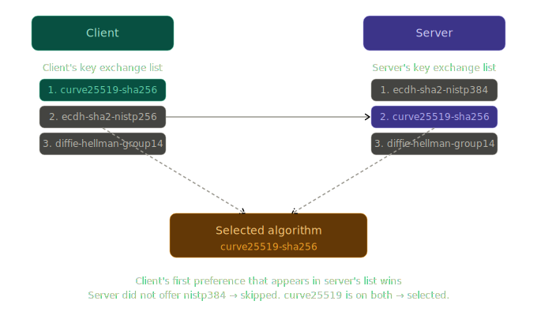
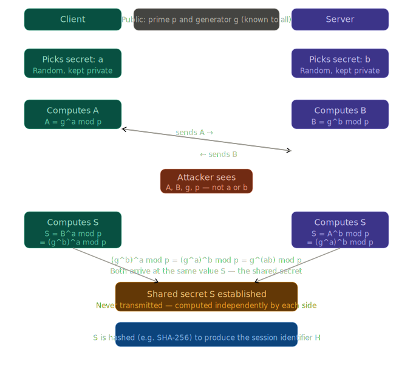
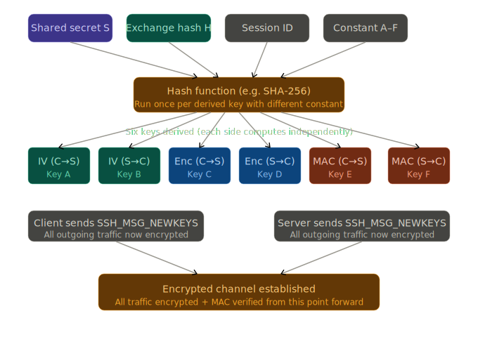

## SSH connects

##  Algorithm Negotiation

This is where SSH's flexibility becomes visible. SSH does not hardcode a single encryption method. Instead, it supports a menu of algorithms for each role, and the two sides negotiate which ones to use.

The negotiation includes lists for both Client-to-Server and Server-to-Client directions. This is because SSH allows for asymmetric settings: a connection could theoretically use one encryption method for uploading data and a different one for downloading data.

**The four algorithm roles**

SSH needs algorithms for four distinct jobs:
1. **Key exchange algorithm**: This is the method used to establish a shared secret between client and server, without that secret ever travelling across the network(The math used to generate the shared secret). The most common examples are Diffie-Hellman variants and Elliptic Curve Diffie-Hellman (ECDH).

2. **Host key algorithm**: (also called server authentication algorithm) — This is the method used by the server to prove its identity. The server has a long-term key pair, and this algorithm governs the type of that key pair. Common examples are RSA and Ed25519.
    - In the context of SSH, a long-term key pair is a set of two mathematically linked cryptographic keys, **a private key** and **a public key** that are generated once and stored on a server (or client) for an extended period, usually years.
    - Unlike the "session keys" created during a connection (which vanish the moment you log out), long-term keys are the permanent "ID cards" of the machines involved.

3. **Symmetric encryption algorithm**: Once a shared secret exists, this is the algorithm used to encrypt all actual data. Both sides use the same key to encrypt and decrypt. Common examples are AES (Advanced Encryption Standard) variants such as AES-256-CTR and ChaCha20-Poly1305.

4. **MAC algorithm**: (Message Authentication Code)  This ensures data has not been tampered with in transit. It produces a small checksum from the data plus a secret key. If even one bit changes, the checksum will not match. Common examples are HMAC-SHA2-256 and HMAC-SHA2-512. Note: when an AEAD cipher like ChaCha20-Poly1305 is used, the MAC is built in and a separate MAC algorithm is not needed.

5. **Compression**: Reduces the size of the data payload before encryption. SSH can compress it to save bandwidth. While less common on high-speed modern networks (as it can introduce slight latency and potential security side-channels like the CRIME attack), it is still a negotiated part of the protocol. Common Examples: zlib, zlib@openssh.com

**How negotiation works**

Each side sends a message called `SSH_MSG_KEXINIT`. This message contains an ordered list of supported algorithms for each role — listed from most preferred to least preferred.

The result is chosen using a simple rule: the first algorithm in the client's list that also appears in the server's list is selected.

This means the client's preference order takes precedence.

The same negotiation process happens independently for all four algorithm roles — key exchange, host key, symmetric cipher, and MAC.

> `SSH_MSG_KEXINIT` both parties initiated

## Key exchange algorithm

With the algorithm selection finalized, the next objective is to establish a secure, encrypted channel. For this to work, both the client and the server must arrive at the same shared secret key, which will be used to encrypt and decrypt all subsequent data.

There is a catch here that secret code should not sent over network, To solve this, the protocol uses the `KEXDH_INIT` and `KEXDH_REPLY` messages.

These steps allow both parties to exchange public mathematical values and combine them with their own private data. Through the logic of the Diffie-Hellman algorithm, both sides calculate the exact same secret key independently, without that key ever actually traveling across the connection.

**Why a shared secret cannot just be sent directly**

If the client simply generated a random secret and sent it to the server, there is a problem: nothing is encrypted yet. Any attacker watching the connection could read that secret. The entire puzzle is that encryption keys need to be shared, but they cannot be shared until there is encryption.

### Algorithm

[Diffie-Hellman](../../algorithms/Diffie-Hellman.md) solves this by making it mathematically impossible to derive the secret even when an attacker can see everything both sides send.

In Diffie-Hellman:
* There is a large prime number p (the modulus). In practice, this is typically 2048 to 4096 bits — an astronomically large number.
* There is a generator g, typically the small number 2 or 5.
* Both p and g are public. Everyone can know them.

The key operation is: `g^x mod p`

This one-way property is the entire foundation. It is easy to go forward; it is practically impossible to go backward.

The mathematical elegance here is that `(g^a)^b mod p` and `(g^b)^a mod p` are mathematically identical — they both equal `g^(ab) mod p`. So both sides arrive at the same secret number `S`, even though they each only contributed half the information.

An attacker watching the network sees `A`, `B`, `g`, and `p`. To recover the shared secret, the attacker would need to find `a` from `A = g^a mod p`, or find `b` from `B = g^b mod p`. This is the discrete logarithm problem, and with a sufficiently large prime `p`, it is computationally infeasible.

**Modern variants — ECDH**

The classical Diffie-Hellman described above uses very large numbers (2048+ bits) to be secure. A more modern approach called Elliptic Curve Diffie-Hellman (ECDH) achieves the same goal using a different mathematical structure — points on an elliptic curve — which provides equivalent security with much smaller numbers (256 bits). This makes it faster and more efficient. The algorithm `curve25519-sha256` seen in the negotiation example above is an `ECDH` variant.

The mathematical details differ, but the principle is the same: two parties each contribute a private value, exchange public values derived from it, and independently compute the same shared secret.

### Process of Key exchange

#### Client
Before the client sends the first Key Exchange message, it must generate its own private contribution to the secret.
1. Generation of Private Value: The client generates a random private number, usually denoted as `a`. This number is kept strictly internal and is never shared with the server or the network.
2. Calculation of Public Value: Using the agreed-upon algorithm (e.g., Diffie-Hellman), the client calculates its public value, `A`. This is done using the formula $A = g^a \pmod p$,
3. Internal State Check: The client prepares to receive the server's identity. It ensures it is ready to verify the server’s digital signature once the response arrives.

The client initiates the exchange by sending the `SSH_MSG_KEXDH_INIT` message. Despite the complexity of the math involved, the payload of this message is remarkably simple. It contains:
* Message Type: A byte identifying the packet as a Key Exchange Initial message.
* The Public Value ($A$): This is the result of the $g^a \pmod p$ calculation.
The payload does not contain the private number $a$ or any information about the client's identity. It is simply a mathematical "half-link" sent to the server.

#### Server
When the server receives the KEXDH_INIT packet, it performs a series of critical operations to finalize the secure tunnel.
1. Similar to the client, the server generates its own random private number, $b$. It then calculates its own public value, $B$, using the same agreed-upon base and modulus: $B = g^b \pmod p$
2. The server now has everything it needs to calculate the final shared secret, $S$. It takes the client’s public value ($A$) and combines it with its own private value ($b$):$$S = A^b \pmod p$$
3. Because of the properties of exponents, this value $S$ is identical to the one the client will eventually calculate  ($B^a \pmod p$).
4. To ensure the entire connection is secure and hasn't been tampered with, the server creates a digital "snapshot" called the Exchange Hash ($H$). This hash is a summary of everything that has happened so far, including:
    * The version strings of both machines.
    * The original KEXINIT messages (the "menu" of algorithms).
    * The server's public host key(long-term).
    * The public values $A$ and $B$.
    * The shared secret $S$.
5. The server uses its Long-term Private Host Key (its permanent ID) to sign the Exchange Hash ($H$). This signature serves as proof that the server is who it claims to be. An attacker could potentially calculate $S$, but an attacker cannot create a valid signature without the server’s private host key.
6. `SSH_MSG_KEXDH_REPLY`: The server packages the following into a reply to the client:
    * The Server’s Public Host Key: To let the client know which "ID card" to check.
    * The Server’s Public Value ($B$): So the client can calculate $S$.
    * The Digital Signature: To prove the server's identity.

    Since server already have all the recepies, it will calculate the `The Six Distinct Keys` and send `SSH_MSG_NEWKEYS` as well it might happen, more info explained below

By the end of this exchange, both parties possess enough information to derive the shared secret, ensuring that even if a hacker sees every packet, they lack the private components necessary to calculate the final key.

## Computation of shared secret on client

Upon receiving the `SSH_MSG_KEXDH_REPLY`, the client enters the most critical verification phase of the connection. At this moment, the client has the server's public contribution ($B$), the server's host key, and a digital signature, but the connection is not yet secure.

The client performs the following steps in a strict, linear order to transform these inputs into a trusted, encrypted tunnel.

### 1. Calculation of the Shared Secret ($S$)
The first action the client takes is the mathematical completion of the Diffie-Hellman exchange.
* The Input: The client takes the value $B$ (the server's public piece) from the `SSH_MSG_KEXDH_REPLY` payload.
* The Math: Using its own private value $a$ (which it generated earlier and never shared), the client calculates:$$S = B^a \pmod p$$
* The Result: Because of the modular exponentiation rules, this value $S$ is now identical to the one the server calculated. Both sides now possess the same Shared Secret, but an observer on the network cannot determine it.

### 2. Calculation of the Exchange Hash ($H$)
Before the client can trust $S$, it must ensure no one tampered with the negotiation. The client independently calculates the Exchange Hash ($H$).

The client gathers all the data it has sent and received so far into a single buffer:
* Identity strings: The version names of both client and server.
* Negotiation lists: The exact KEXINIT lists of preferred algorithms.
* Server Host Key: The public key the server just provided.
* Exchange Values: The values $A$ (client public) and $B$ (server public).
* The Shared Secret: The value $S$ just calculated.
The client runs this combined data through a hashing algorithm (like SHA-256). The result is $H$.

### 3. Server Authentication (Verifying the Signature)
The client must now verify that the server is genuine. The `SSH_MSG_KEXDH_REPLY` contained a Digital Signature created by the server.
* The Mechanism: The server created that signature by signing `H` with its Private Host Key.
* The Verification: The client uses the Server's Public Host Key to "unlock" or verify the signature.
* The Logic: If the signature matches the $H$ value the client just calculated, it proves two things:
    - The server possesses the private key corresponding to the public key it sent.
    - The data used to create $H$ (including the algorithm negotiation) was not modified by a third party.

### 4. Trust Verification (The "Genuine" Check)
Even if the signature is mathematically valid, the client must decide if it trusts that specific server. This is the "ID Card" check.
* The Known Hosts Check: The client looks into its local database (typically a file named known_hosts). It searches for the server's address and checks if the Public Host Key provided in the KEXDH_REPLY matches the one stored from previous sessions.
* The Trust Decision:
    - If it matches: The client proceeds silently; the server is recognized.
    - If it is different: The client displays a high-security warning, as this could indicate a "Man-in-the-Middle" attack where someone is impersonating the server.
    - If it is new: The client asks the user to manually verify the "fingerprint" of the key before saving it for future use.

#### Server Host Key Verification in detailed
At this point, a shared secret exists and both sides have computed `H`. But a critical question remains unanswered: is the server that performed this key exchange actually the intended server?

Diffie-Hellman by itself does not answer this. Any party, including an attacker, could have performed the key exchange steps. This attack scenario — where an attacker positions themselves between client and server, performing key exchange with both — is called a man-in-the-middle attack.

To prevent this, the server proves its identity using a long-term host key pair.

**What a key pair is**

A key pair consists of two mathematically linked numbers:
* A private key, which is kept secret and never leaves the server.
* A public key, which can be freely shared with anyone.

The relationship between them is asymmetric: 
- what one encrypts, only the other can decrypt, and vice versa. 
- The private key can be used to produce a digital signature, and the public key can be used to verify that signature. 
- Anyone with the public key can verify that the signature was produced by the holder of the private key — but they cannot produce their own signatures without the private key.

In asymmetric encryption, the public key is by design available to everyone, including malicious actors. However, the security of the system depends on which direction the data is moving.

1. Scenario: Sending Secret Data (Encryption)
    When a user wants to send a private message to a server, they use the Public Key to encrypt it.
    * The Hacker's Limitation: Even if the hacker has the public key, that key is only used to lock the data. In asymmetric math, the public key cannot unlock what it just locked.
    * The Result: Only the Private Key (held safely by the server) can decrypt the message. The hacker can watch the encrypted data pass by, but they cannot read it.
2. Scenario: Proving Identity (Digital Signatures)
    The confusion often arises here: if the private key is used to "sign" something, and the public key is used to "verify" it, can’t the hacker see the data?
    * The Goal: Digital signatures are not always about hiding the data; they are about authenticity.
    * The Hacker's Limitation: The hacker can use the public key to verify the signature and see the content. However, the hacker cannot change the content or create a fake message that looks like it came from the server.
    * The Result: If the hacker tries to alter even one bit of the signed message, the public key verification will fail. The hacker can "see," but they cannot "act" as the server.
3. The Combined Approach (The "Envelope")
    In real-world systems like HTTPS (websites), the public/private key pair is often used just to safely exchange a temporary secret password (a symmetric key). **In SSH, the shared secret is established via Diffie-Hellman, the public key is never used to encrypt a symmetric key.**
    1. The user's computer picks a random password.
    2. The computer encrypts that password using the server's Public Key.
    3. The hacker sees this encrypted package but cannot open it.
    4. The server opens it with the Private Key.
    5. Now, both sides have a secret password that the hacker never saw.

**Common host key algorithms** 
* RSA — The oldest and most widely supported. Security comes from the difficulty of factoring large numbers. Key sizes of 2048 or 4096 bits are used.
* ECDSA — Uses elliptic curve mathematics. More efficient than RSA at equivalent security levels.
* Ed25519 — A modern elliptic curve algorithm on a specific curve called Curve25519. It is fast, has very short keys (32 bytes), and is considered highly secure. It is the preferred choice in modern deployments.

#### The hash function's role

After both sides have computed the shared secret `S`, it is not used directly as an encryption key. Instead, both sides run `S` — along with other values like the version strings and the public keys exchanged — through a cryptographic hash function such as `SHA-256`. 

**Why H is calculated?**

Because $S$ is a product of a mathematical exchange, it might have specific patterns or a length that doesn't fit a standard encryption algorithm like AES-256:

A hash function takes any input and produces a fixed-size output (256 bits for SHA-256). It is a one-way function: given the output, it is computationally infeasible to reconstruct the input. It is also collision-resistant: it is infeasible to find two different inputs that produce the same output.

The output of this hash operation is called `H`, the exchange hash, which also serves as the session identifier. This value is used in the next stage.

The shared secret ($S$) and the exchange hash ($H$) are not used directly to encrypt data. Using the raw secret for everything is cryptographically risky. Instead, SSH uses a process called **Key Derivation** to "stretch" these values into six distinct keys.

Once $S$ and $H$ are established, both the client and the server independently calculate the following:

### The Six Distinct Keys (session keys)
SSH uses the exchange hash `H`, the shared secret `S`, and a set of single-letter constants (`A through `F`) as inputs to the negotiated hash function (e.g. SHA-256) to derive six distinct values:

| Key Name | Symbol|Purpose | Direction |
| :--- | :--- | :--- | :--- |
| **Initial IV (C to S)** | $A$ |Initialization Vector for Encryption | Client $\rightarrow$ Server |
| **Initial IV (S to C)** | $B$|Initialization Vector for Encryption | Server $\rightarrow$ Client |
| **Encryption Key (C to S)** | $C$ |The actual key used to encrypt data | Client $\rightarrow$ Server |
| **Encryption Key (S to C)** | $D$ |The actual key used to encrypt data | Server $\rightarrow$ Client |
| **Integrity Key (C to S)** | $E$ |The MAC key to prevent tampering | Client $\rightarrow$ Server |
| **Integrity Key (S to C)** | $F$ |The MAC key to prevent tampering | Server $\rightarrow$ Client |

At this point both parties have all the keys

The Signal: The client sends a message called `SSH_MSG_NEWKEYS`. This is a clear-text message that says, "From this point forward, every packet I send will be encrypted with the keys we just derived."

If server didn't said `SSH_MSG_NEWKEYS` before upon receiving client's `SSH_MSG_NEWKEYS`, it will send it's own `SSH_MSG_NEWKEYS`

## How encryption and MAC work on every packet
With the session keys(6 keys) in place, it is worth understanding exactly what happens to each piece of data sent across the connection.

### The symmetric cipher — encrypting the content
The symmetric cipher (such as AES-256-CTR or ChaCha20) takes:
* The data to be sent (plaintext)
* The encryption key (Key C or Key D from above)
* The initialisation vector or a counter
And produces an encrypted output (ciphertext) that appears as random bytes to anyone without the key.

* CTR mode (Counter mode) works by encrypting a counter value to produce a keystream, then XORing the plaintext with the keystream. This turns a block cipher into a stream cipher, meaning data of any length can be encrypted without needing to pad to a fixed block size.

* ChaCha20-Poly1305 is a modern construction where ChaCha20 handles the encryption and Poly1305 handles the authentication. They are combined so the authentication covers the ciphertext, ensuring integrity and encryption in a single pass.

### The MAC — verifying integrity
For ciphers that do not have built-in authentication, a separate MAC is computed. The MAC function takes:

* The plaintext (or ciphertext, depending on the scheme)
* The MAC key (Key E or Key F)
* A packet sequence number

And produces a fixed-size value (e.g. 32 bytes for HMAC-SHA2-256).

The recipient recomputes the MAC from the received data and the known MAC key, then compares it to the MAC sent alongside the data. If they match, the data has not been tampered with. If they do not match, the connection is immediately terminated.

The sequence number prevents replay attacks, where an attacker records an old packet and replays it later. Because the sequence number increments for every packet, replayed packets will have wrong MACs.

### Decryption
Decryption is simply the reverse: the recipient takes the ciphertext and the encryption key, runs them through the same cipher algorithm, and recovers the original plaintext. For symmetric ciphers, the same key encrypts and decrypts — this is why it is called symmetric. Both sides already have the key from the derivation step.

### Why so many algorithms — the full answer
This is the question that the entire document builds toward. Each algorithm type solves a specific problem that no other algorithm type can solve alone.

1. The key exchange algorithm (Diffie-Hellman / ECDH) solves the bootstrapping problem. Without it, there is no way to establish a shared secret over an untrusted network. It uses asymmetric mathematics — the hard direction of the discrete logarithm problem — to allow two parties to compute the same secret independently.

2. The host key algorithm (RSA / Ed25519) solves the identity problem. Diffie-Hellman alone does not tell either party who they are talking to. A digital signature from a known server key, tied to the exchange hash, proves the server is legitimate and not an impostor.

3. The symmetric cipher (AES / ChaCha20) solves the performance problem. Asymmetric cryptography is mathematically expensive — it cannot encrypt large volumes of data at interactive speeds. Once a shared secret exists from the key exchange, a symmetric cipher uses that secret to encrypt all session data at very high speed with much simpler operations.

4. The MAC algorithm (HMAC-SHA2 / Poly1305) solves the integrity problem. Encryption alone does not prevent an attacker from flipping bits in the ciphertext. Without a MAC, the attacker could modify encrypted data and the recipient might decrypt corrupted content without knowing. The MAC, keyed with a secret derived from the shared secret, makes any tampering immediately detectable.

Each algorithm is a layer of a complete security system. Removing any one of them leaves a specific, exploitable gap. Together, they make the connection confidential, authenticated, and tamper-evident.
