## Session establishment

Before any application data crosses the wire, the session layer performs an establishment phase. This phase accomplishes several things simultaneously.

* **Negotiation of session parameters**: 
    The two sides agree on what the session will look like: which direction data flows (simplex, half-duplex, full-duplex), how large the data units will be, whether checkpointing will be used, and what the session timeout is. This negotiation is explicit — both sides exchange parameters and confirm agreement before proceeding.
* **Authentication**:
    The session layer is one of the places where identity is verified. This is distinct from the transport layer's job of verifying connectivity. At the session layer, the question is not "can bytes reach this machine" but "is this machine allowed to participate in this session." Authentication may involve credentials (username and password), cryptographic tokens, or certificates. In modern systems, this function is often handled by TLS (which lives at the presentation layer boundary) or by application-layer protocols like OAuth, but the conceptual responsibility belongs to the session layer.
* **Authorization**:
    After identity is confirmed, the session layer determines what the authenticated party is allowed to do. Authorization is the transition from "this is who they are" to "this is what they may do." A session that is authenticated but not authorized is still rejected.
* **Session identifier assignment**:
    Once establishment succeeds, the session layer assigns a session identifier — a value that uniquely names this session for its lifetime. Every message exchanged from this point forward is tagged with or associated with this identifier. This is what allows multiple sessions between the same two endpoints to coexist without confusion.

### Session identifiers — how sessions are named and tracked

A session identifier (session ID) is the key that the session layer uses to distinguish one session from another. Without session identifiers, two simultaneous conversations between the same client and server would be indistinguishable.

Two endpoints sharing an IP and port but distinguished by a Session ID, It is **[Session Multiplexing](./multiplexing.md)**

A session identifier must satisfy several properties:

* **Uniqueness**. No two active sessions may share an identifier. If the same client opens two sessions to the same server simultaneously, each gets a different identifier.

* **Scope**. A session identifier is scoped to the two endpoints and the session layer implementation. It does not need to be globally unique across all systems — only unique within the context where it will be used.

* **Unpredictability**. Because session identifiers are often transmitted and stored (in cookies, headers, or application memory), they must not be guessable. A predictable session ID allows an attacker to hijack a session by constructing its identifier without ever observing it. This is called session fixation or session prediction. Properly generated session IDs use cryptographically random values with sufficient entropy (at minimum 128 bits).

* **Lifecycle**. A session identifier is created during session establishment and invalidated during session termination. Between those two events, every message in the session references the same identifier. After termination, the identifier must not be reused for a different session.

In HTTP-based systems, session identifiers are typically stored in cookies (using the Set-Cookie header) or in URL query parameters. The cookie approach is preferred because it does not expose the session ID in server logs or browser history. The HttpOnly flag prevents JavaScript from reading the cookie, and the Secure flag ensures it is only sent over HTTPS.

